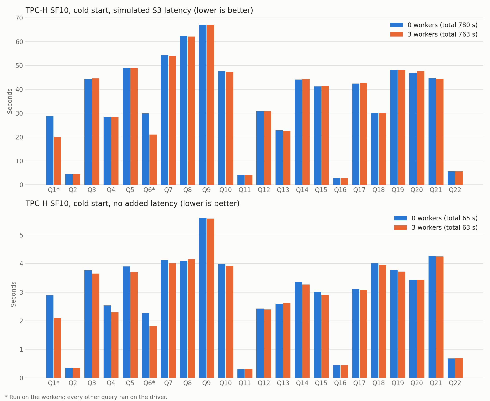

# TPC-H benchmark over ObjFS

Runs the 22 TPC-H queries through a duckherder driver with 0..N workers, checks the results, and times them. Data lives in an ObjFS database on S3-compatible storage (local RustFS by default).

Timings are only meaningful on Linux, where each process runs in its own cgroup.

## Build

Requires `pkg-config`, `flex`, `bison`, `libtool`, `cargo`, vcpkg, and Docker for RustFS. Set `LATENCY_INJECTION_FS_DIR` to a [duckdb-filesystem-latency-injection](https://github.com/dentiny/duckdb-filesystem-latency-injection) checkout to build it in for simulating storage latency; leave it unset otherwise.

```sh
LATENCY_INJECTION_FS_DIR=$HOME/duckdb-filesystem-latency-injection \
VCPKG_TOOLCHAIN_PATH=$HOME/vcpkg/scripts/buildsystems/vcpkg.cmake CORE_EXTENSIONS='tpch' GEN=ninja \
  CMAKE_BUILD_PARALLEL_LEVEL=$(getconf _NPROCESSORS_ONLN) make release
```

## Run

From the repository root:

```sh
# Storage, pinned away from the benchmark CPUs.
scripts/local-rustfs.sh start
docker update --cpuset-cpus 16-19 --memory 2g --memory-swap 2g duckherder-rustfs

# Data, once per scale factor. The local file is the reference for result checks.
source benchmark/tpch/rustfs.env && mkdir -p benchmark/tpch/work
TPCH_FILE=benchmark/tpch/work/tpch_sf10.duckdb benchmark/tpch/load.sh 10 s3://duckherder/tpch-sf10

# Benchmark with S3-like latency: client on CPUs 0-1, driver on 8-9, workers on 2-3, 4-5, and 6-7, each with 4 GiB.
DUCKHERDER_STARTUP_SQL="$(cat benchmark/tpch/s3_latency.sql)" \
WORKER_CPUS="2-3 4-5 6-7" WORKER_MEMORY=4G DRIVER_CPUS=8-9 DRIVER_MEMORY=4G \
systemd-run --user --scope -p AllowedCPUs=0-1 -p CPUQuota=200% -p MemoryMax=4G \
  benchmark/tpch/bench.sh --sf 10 --workers "0 3" --data-path s3://duckherder/tpch-sf10 --no-load --cold
```

`systemd-run --user` needs the `cpuset` controller delegated to user sessions (`Delegate=cpu cpuset io memory pids` in a `user@.service` drop-in).

## Options

| Option | Default | Meaning |
| --- | --- | --- |
| `--sf` | `1` | TPC-H scale factor |
| `--workers` | `"0 2"` | Worker counts to run; with 0 the driver runs queries itself |
| `--reps` | `5` | Measured runs per query |
| `--warmup` | `1` | Warm-up runs per query, excluded from `summary.csv` |
| `--cold` | off | Restart the driver and workers before every run, so no run reuses data cached by an earlier one; no warm-up |
| `--data-path` | `s3://duckherder/tpch-sf<sf>` | Where the ObjFS database lives; loaded on first use unless `--no-load` |
| `--env` | `rustfs.env` | File that sets `S3_SETUP_SQL`, the SQL creating the S3 secret `s3` |
| `--skip-verify` | off | Skip checking results against plain DuckDB |
| `--worker-hosts` | none | Use running workers at these `host:port` addresses instead of starting them |
| `--driver-ssh` | none | Start the driver on this SSH destination; it needs `REMOTE_DUCKDB` |
| `--driver-endpoint` | `localhost:8815` | Address the client attaches to |

| Environment variable | Meaning |
| --- | --- |
| `WORKER_CPUS`, `DRIVER_CPUS` | CPU lists, one per worker; each process gets a systemd scope with that `AllowedCPUs` and a matching `CPUQuota`, which sets DuckDB's thread count |
| `WORKER_MEMORY`, `DRIVER_MEMORY` | `MemoryMax` of those scopes (default `4G`); DuckDB uses 80% of it |
| `DUCKHERDER_STARTUP_SQL` | SQL the driver and workers run in their databases before attaching the data, e.g. `s3_latency.sql` |

The client stays in the cgroup `bench.sh` runs in.

## Simulated latency

`s3_latency.sql` wraps `SlateDBFileSystem`, the filesystem `duckdb_object_storage` registers for the ObjFS database, with [latency_inject_fs](https://github.com/dentiny/duckdb-filesystem-latency-injection). Each call sleeps before running the real I/O against local RustFS. The driver and every worker wrap their own filesystem.

| Operation | Delay (log-normal) | Mean | Standard deviation |
| --- | --- | ---: | ---: |
| Read | base, plus `bytes / 88000` ms | 30 ms | 15 ms |
| Stat | base | 20 ms | 10 ms |
| List | base | 40 ms | 20 ms |

The values approximate S3 Standard within a region.

## Output

Each run writes `results/<time>-sf<sf>/`:

- `summary.csv`: median seconds per query, one column per worker count
- `metadata.json`: commit, settings, CPU and memory limits, and startup SQL
- `n<N>.csv`: every timing; `n<N>.log` ends with the SQL each query sent to the driver
- `cold-n<N>/`: per-run logs with `--cold`; `verify-n<N>/`: query and reference results
- `n<N>-driver.log`, `n<N>-worker<i>.log`: process logs

## Results

SF10 with the run command above (`--cold`, one run per query) on an i7-12700K (8 performance cores with two threads each, 4 efficiency cores, 31 GiB). Each DuckDB process gets 2 threads of one performance core and 4 GiB; RustFS gets the 4 efficiency cores. Seconds per query, with simulated S3 latency (`s3_latency.sql`) and without:



| Query | Latency, 0 workers | Latency, 3 workers | None, 0 workers | None, 3 workers |
| ---: | ---: | ---: | ---: | ---: |
| 1 | 28.79 | 20.04 | 2.89 | 2.09 |
| 2 | 4.47 | 4.45 | 0.35 | 0.36 |
| 3 | 44.30 | 44.59 | 3.77 | 3.65 |
| 4 | 28.33 | 28.43 | 2.53 | 2.30 |
| 5 | 48.95 | 48.88 | 3.90 | 3.70 |
| 6 | 29.89 | 21.09 | 2.27 | 1.81 |
| 7 | 54.46 | 53.93 | 4.13 | 4.01 |
| 8 | 62.36 | 62.16 | 4.09 | 4.15 |
| 9 | 67.14 | 67.17 | 5.60 | 5.57 |
| 10 | 47.59 | 47.34 | 3.98 | 3.92 |
| 11 | 4.04 | 4.13 | 0.30 | 0.31 |
| 12 | 30.91 | 30.86 | 2.42 | 2.40 |
| 13 | 22.81 | 22.59 | 2.60 | 2.62 |
| 14 | 44.18 | 44.31 | 3.36 | 3.27 |
| 15 | 41.29 | 41.56 | 3.02 | 2.91 |
| 16 | 2.79 | 2.72 | 0.44 | 0.44 |
| 17 | 42.51 | 42.87 | 3.11 | 3.08 |
| 18 | 30.01 | 30.03 | 4.02 | 3.95 |
| 19 | 48.19 | 48.26 | 3.78 | 3.73 |
| 20 | 46.97 | 47.66 | 3.44 | 3.44 |
| 21 | 44.71 | 44.56 | 4.27 | 4.25 |
| 22 | 5.62 | 5.66 | 0.68 | 0.69 |
| **Total** | **780.3** | **763.3** | **65.0** | **62.7** |
