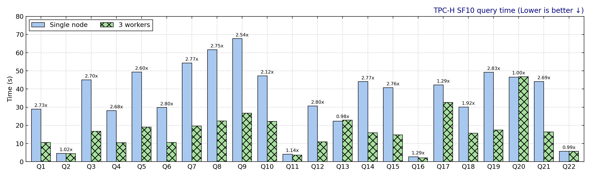
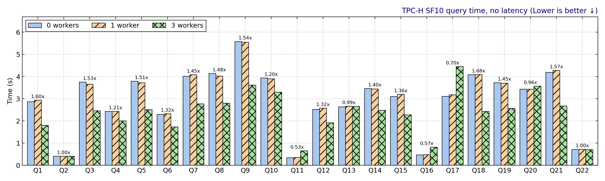

# TPC-H benchmark over ObjFS

Runs the 22 TPC-H queries through a duckherder driver with 0..N workers, checks the results, and times them. Data lives in an ObjFS database on S3-compatible storage (local RustFS by default).

Timings are only meaningful on Linux, where each process runs in its own cgroup.

## Build

Requires `pkg-config`, `flex`, `bison`, `libtool`, `cargo`, vcpkg, and Docker and curl 7.75 or later for RustFS. Set `LATENCY_INJECTION_FS_DIR` to a [duckdb-filesystem-latency-injection](https://github.com/dentiny/duckdb-filesystem-latency-injection) checkout to build it in for simulating storage latency; leave it unset otherwise.

```sh
LATENCY_INJECTION_FS_DIR=$HOME/duckdb-filesystem-latency-injection \
VCPKG_TOOLCHAIN_PATH=$HOME/vcpkg/scripts/buildsystems/vcpkg.cmake CORE_EXTENSIONS='tpch' GEN=ninja \
  CMAKE_BUILD_PARALLEL_LEVEL=$(getconf _NPROCESSORS_ONLN) make release
```

## Run

From the repository root:

```sh
# Storage, pinned away from the benchmark CPUs.
scripts/local-rustfs.sh start
docker update --cpuset-cpus 16-19 --memory 2g --memory-swap 2g duckherder-rustfs

# Data, once per scale factor. The local file is the reference for result checks.
source benchmark/tpch/rustfs.env && mkdir -p benchmark/tpch/work
TPCH_FILE=benchmark/tpch/work/tpch_sf10.duckdb benchmark/tpch/load.sh 10 s3://duckherder/tpch-sf10

# Benchmark with S3-like latency: client on CPUs 0-1, driver on 8-9, workers on 2-3, 4-5, and 6-7, each with 4 GiB.
DUCKHERDER_STARTUP_SQL="$(cat benchmark/tpch/s3_latency.sql)" \
WORKER_CPUS="2-3 4-5 6-7" WORKER_MEMORY=4G DRIVER_CPUS=8-9 DRIVER_MEMORY=4G \
systemd-run --user --scope -p AllowedCPUs=0-1 -p CPUQuota=200% -p MemoryMax=4G \
  benchmark/tpch/bench.sh --sf 10 --workers "0 3" --data-path s3://duckherder/tpch-sf10 --no-load --cold
```

`systemd-run --user` needs the `cpuset` controller delegated to user sessions (`Delegate=cpu cpuset io memory pids` in a `user@.service` drop-in).

## Options

| Option | Default | Meaning |
| --- | --- | --- |
| `--sf` | `1` | TPC-H scale factor |
| `--queries` | all 22 | Queries to run, e.g. `"1 6 12"` or `1,6,12`; also limits the result check |
| `--workers` | `"0 2"` | Worker counts to run; with 0 the driver runs queries itself |
| `--reps` | `5` | Measured runs per query |
| `--warmup` | `1` | Warm-up runs per query, excluded from `summary.csv` |
| `--cold` | off | Restart the driver and workers before every run, so no run reuses data cached by an earlier one; no warm-up |
| `--data-path` | `s3://duckherder/tpch-sf<sf>` | Where the ObjFS database lives; loaded on first use unless `--no-load` |
| `--env` | `rustfs.env` | File that sets `S3_SETUP_SQL`, the SQL creating the S3 secret `s3` |
| `--skip-verify` | off | Skip checking results against plain DuckDB |
| `--worker-hosts` | none | Use running workers at these `host:port` addresses instead of starting them |
| `--driver-ssh` | none | Start the driver on this SSH destination; it needs `REMOTE_DUCKDB` |
| `--driver-endpoint` | `localhost:8815` | Address the client attaches to |

| Environment variable | Meaning |
| --- | --- |
| `WORKER_CPUS`, `DRIVER_CPUS` | CPU lists, one per worker; each process gets a systemd scope with that `AllowedCPUs` and a matching `CPUQuota`, which sets DuckDB's thread count |
| `WORKER_MEMORY`, `DRIVER_MEMORY` | `MemoryMax` of those scopes (default `4G`); DuckDB uses 80% of it |
| `DUCKHERDER_STARTUP_SQL` | SQL the driver and workers run in their databases before attaching the data, e.g. `s3_latency.sql` |

The client stays in the cgroup `bench.sh` runs in.

## Simulated latency

`s3_latency.sql` wraps `SlateDBFileSystem`, the filesystem `duckdb_object_storage` registers for the ObjFS database, with [latency_inject_fs](https://github.com/dentiny/duckdb-filesystem-latency-injection). Each call sleeps before running the real I/O against local RustFS. The driver and every worker wrap their own filesystem.

| Operation | Delay (log-normal) | Mean | Standard deviation |
| --- | --- | ---: | ---: |
| Read | base, plus `bytes / 88000` ms | 30 ms | 15 ms |
| Stat | base | 20 ms | 10 ms |
| List | base | 40 ms | 20 ms |

The values approximate S3 Standard within a region.

## Output

The console prints each query number as it runs. Each run writes `results/<time>-sf<sf>/`:

- `summary.csv`: median seconds per query, one column per worker count
- `metadata.json`: commit, settings, CPU and memory limits, and startup SQL
- `n<N>.csv`: every timing
- `runs-n<N>/`: `q<query>.log` and `.csv` per query, or `q<query>-r<run>` per run with `--cold`; each log ends with the SQL the query sent to the driver
- `verify-n<N>/`: query and reference results
- `n<N>-driver.log`, `n<N>-worker<i>.log`: process logs

## Test setup

Everything runs on one machine, an i7-12700K with 31 GiB of memory. Its CPUs 0-15 are the 8 performance cores with two threads each, and CPUs 16-19 are the 4 efficiency cores. Each process is pinned to its own CPUs so the processes don't compete with each other:

| Process | CPUs | Memory limit |
| --- | --- | --- |
| Client (`bench.sh` and the DuckDB shell it runs) | 0-1 | 4 GiB |
| Worker 1, 2, 3 | 2-3, 4-5, 6-7 | 4 GiB each |
| Driver | 8-9 | 4 GiB |
| RustFS | 16-19 | 2 GiB |

So each DuckDB process gets both threads of one performance core. CPUs 10-15 stay idle.

- **DuckDB processes.** `bench.sh` starts the driver and each worker in its own systemd scope (`systemd-run --user --scope`), which is a cgroup. `AllowedCPUs` pins the scope to its CPUs. `CPUQuota` is set to 100% per CPU; DuckDB reads it to pick its thread count, because it ignores the cpuset. `MemoryMax` caps the scope's memory, and DuckDB sets its memory limit to 80% of it. The client gets the same limits from the outer `systemd-run` in the run command.
- **RustFS.** RustFS is the S3-compatible object store holding the data. `scripts/local-rustfs.sh` runs it in a Docker container on the same machine, with its data in a Docker volume on the local disk, and serves S3 at `127.0.0.1:19000`. `docker update --cpuset-cpus 16-19 --memory 2g` pins it to the efficiency cores. Because storage is local, every request is fast; `s3_latency.sql` adds the delay a real S3 bucket would have (see above).

## Results

SF10 with the run command above (`--cold`, one run per query) on the machine described below. Seconds per query; Speedup is 0 workers over 3 workers. Queries 2, 13, 20 and 22 run on the driver; the others run on the workers. With 1 worker, the worker has the same two CPUs as the driver, so it takes as long as 0 workers.

With simulated S3 latency (`s3_latency.sql`):



| Query | 0 workers | 1 worker | 3 workers | Speedup |
| ---: | ---: | ---: | ---: | ---: |
| 1 | 28.63 | 29.68 | 10.89 | 2.63x |
| 2 | 4.73 | 4.32 | 4.62 | 1.02x |
| 3 | 44.68 | 44.71 | 15.79 | 2.83x |
| 4 | 28.54 | 28.73 | 10.72 | 2.66x |
| 5 | 48.08 | 48.32 | 17.53 | 2.74x |
| 6 | 29.62 | 30.71 | 10.75 | 2.75x |
| 7 | 54.43 | 53.85 | 19.71 | 2.76x |
| 8 | 61.82 | 62.78 | 22.38 | 2.76x |
| 9 | 66.83 | 66.97 | 26.59 | 2.51x |
| 10 | 46.97 | 47.44 | 22.05 | 2.13x |
| 11 | 4.24 | 3.99 | 3.20 | 1.32x |
| 12 | 30.17 | 30.89 | 11.05 | 2.73x |
| 13 | 22.57 | 23.02 | 22.56 | 1.00x |
| 14 | 44.55 | 43.74 | 16.06 | 2.77x |
| 15 | 41.88 | 41.60 | 14.99 | 2.79x |
| 16 | 2.71 | 2.67 | 2.35 | 1.15x |
| 17 | 42.49 | 42.59 | 33.20 | 1.28x |
| 18 | 29.88 | 29.89 | 11.85 | 2.52x |
| 19 | 48.71 | 48.67 | 17.46 | 2.79x |
| 20 | 46.95 | 47.66 | 47.71 | 0.98x |
| 21 | 44.57 | 44.14 | 16.14 | 2.76x |
| 22 | 5.90 | 5.77 | 5.51 | 1.07x |
| **Total** | **778.9** | **782.1** | **363.1** | **2.15x** |

Without simulated latency:



| Query | 0 workers | 1 worker | 3 workers | Speedup |
| ---: | ---: | ---: | ---: | ---: |
| 1 | 2.87 | 2.94 | 1.79 | 1.60x |
| 2 | 0.41 | 0.41 | 0.41 | 1.00x |
| 3 | 3.75 | 3.65 | 2.46 | 1.53x |
| 4 | 2.43 | 2.43 | 2.01 | 1.21x |
| 5 | 3.79 | 3.72 | 2.50 | 1.51x |
| 6 | 2.29 | 2.33 | 1.73 | 1.32x |
| 7 | 4.02 | 4.08 | 2.77 | 1.45x |
| 8 | 4.14 | 4.02 | 2.80 | 1.48x |
| 9 | 5.58 | 5.55 | 3.61 | 1.54x |
| 10 | 3.94 | 3.90 | 3.29 | 1.20x |
| 11 | 0.35 | 0.35 | 0.65 | 0.53x |
| 12 | 2.52 | 2.58 | 1.92 | 1.32x |
| 13 | 2.63 | 2.66 | 2.65 | 0.99x |
| 14 | 3.46 | 3.44 | 2.48 | 1.40x |
| 15 | 3.10 | 3.20 | 2.28 | 1.36x |
| 16 | 0.47 | 0.48 | 0.82 | 0.57x |
| 17 | 3.11 | 3.17 | 4.45 | 0.70x |
| 18 | 4.08 | 4.09 | 2.43 | 1.68x |
| 19 | 3.72 | 3.71 | 2.56 | 1.45x |
| 20 | 3.43 | 3.43 | 3.57 | 0.96x |
| 21 | 4.18 | 4.28 | 2.67 | 1.57x |
| 22 | 0.71 | 0.72 | 0.70 | 1.00x |
| **Total** | **65.0** | **65.1** | **50.6** | **1.29x** |
